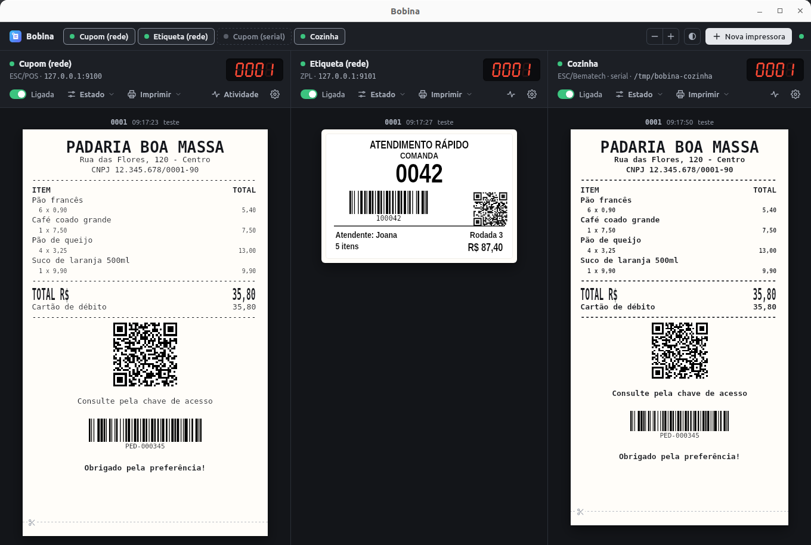

# Bobina

Emulador de impressoras de **cupom (ESC/POS)** e **etiqueta (ZPL)** para testar
sistemas sem impressora de verdade. Várias impressoras ao mesmo tempo, cada uma
na sua conexão (rede, serial ou pasta PRN), respondendo ao status como uma
impressora real, e você decide se ela está sem papel, com a tampa aberta,
desligada...



- Aplicativo de desktop com janela nativa e sem navegador: GTK + WebKit no
  Linux, WebView2 no Windows (já vem no Windows 10 e 11). Um executável só, de
  ~8 MB, sem Electron.
- Desenha tudo localmente. Nada vai para serviço externo (diferente do
  ZplEscPrinter, que manda cupons e etiquetas para a internet).
- Mostra o que cada byte significa e avisa os erros comuns de integração.

## Rodar

```bash
go run .                 # abre o aplicativo
go run . -sem-janela     # só o servidor (CI, servidor de testes)
make                     # gera os executáveis de Linux, Windows e macOS em dist/
make instalar            # Linux: instala para o seu usuário e põe no menu de aplicativos
make desinstalar         # remove o que o "make instalar" colocou
```

Precisa do Go 1.26 ou mais novo. Se o `go` do sistema for mais antigo, indique outro:
`make instalar GO=/caminho/para/go`.

Fechar a janela encerra o emulador. Por dentro, a tela conversa com o motor por
<http://127.0.0.1:8631>, a mesma API usada nos testes automatizados.

Para compilar no Linux é preciso o `libwebkit2gtk-4.1-dev` (`sudo apt install
libwebkit2gtk-4.1-dev`); para rodar, só o `libwebkit2gtk-4.1-0`, que já vem no
Ubuntu. O executável do Windows é gerado do próprio Linux (`make windows`), sem
compilador C, e já sai com ícone (`winres/`, regerado com
`go run github.com/tc-hib/go-winres@latest make --in winres/winres.json --arch amd64`).
No macOS a tela abre no navegador padrão.
As impressoras ficam em `~/.config/bobina/impressoras.json` (no Windows, em
`%AppData%\bobina`); use `-config arquivo.json` para ter um conjunto por projeto.

Na primeira execução são criadas três impressoras de exemplo: cupom na porta
9100, etiqueta na 9101 e, no Linux, um cupom numa serial virtual.

## Conexões

| Conexão | Como o sistema testado se liga |
|---|---|
| **Rede** | TCP na porta escolhida (9100 é o padrão das impressoras). A conexão fica aberta: o sistema pode imprimir e pedir status na mesma conexão. |
| **Serial** | No Linux, deixando a porta em branco, o Bobina cria uma serial virtual e mostra o caminho (`/tmp/bobina-<id>`). No Windows, crie um par com o [com0com](https://com0com.sourceforge.net/) (ex.: COM10 ↔ COM11), escolha uma no Bobina e configure o sistema na outra. Também abre uma porta física. |
| **Pasta PRN** | Cada arquivo de impressão (`.prn`, `.txt`, `.bin`, `.raw`, `.zpl`, `.esc`, `.dat`) que aparecer na pasta é impresso e movido para `impressos/`. Outros arquivos não são tocados. Serve para sistemas que "imprimem em arquivo". |

Para que uma impressora do Windows (driver "Genérico / Somente texto") imprima no
Bobina, crie nela uma porta **TCP/IP padrão** apontando para `127.0.0.1`, porta
9100, protocolo RAW.

## Painel de estado

Cada chave muda a resposta aos pedidos de status. Os cupons que chegam com a
impressora em erro aparecem hachurados como **não impressos**.

| Chave | ESC/POS (`DLE EOT`, `GS r`, `ENQ`) | ZPL (`~HS`, `~HQES`, `getvar`) |
|---|---|---|
| Desligada | rede recusa conexão; serial e pasta não respondem | idem |
| Offline / Pausada | `DLE EOT 1` com bit 3 | `~HS` com pausa; `~PP`/`~PS` mudam a chave |
| Sem papel | `DLE EOT 4` = `7E`, `DLE EOT 2` = `72` | erro `00000001` |
| Papel acabando | `DLE EOT 4` = `1E` | aviso `00000008` |
| Tampa aberta | `DLE EOT 2` com bit 2 | cabeça aberta, erro `00000004` |
| Erro na guilhotina | `DLE EOT 3` com bit 3 | erro `00000008` |
| Gaveta aberta | `DLE EOT 1` com bit 2, `GS r 2` | — |
| Sem ribbon | — | erro `00000002` |

**Responde ao status** reproduz impressoras que não respondem a tudo:
"Só ESC/POS padrão" é uma Bematech no modo ESC/POS (ignora o `ENQ`), "Só
Bematech" responde só ao `ENQ`, e "Não responde" fica calada. **Atraso** segura a
resposta para testar o tempo de espera do sistema.

A aba **Respostas** mostra, ao vivo, o byte que cada pedido recebe agora.

## Inspetor e avisos

Clique num cupom ou etiqueta para ver cada comando com a descrição, os bytes
(hexdump) e o texto puro, e para baixar o `.prn` ou reimprimir. O Bobina avisa:

- texto em UTF-8 numa impressora com página de código (mostra como o acento sai: `ã` → `├ú`);
- linha maior que a bobina;
- Code 128 `{C` com dígitos em texto (`"12"` vira `4950`);
- código de barras inválido, comandos desconhecidos;
- no ZPL: falta de `^XZ`, falta de `^CI28` com acentos, campo passando da borda, texto que não cabe no `^FB`.

## API (para testes automatizados)

```bash
# mudar o estado (só o que muda)
curl -X PATCH localhost:8631/api/impressoras/cupom-rede/estado -d '{"semPapel": true}'

# esperar o próximo trabalho depois do #42 (até 10 s)
curl "localhost:8631/api/impressoras/cupom-rede/trabalhos?desde=42&aguardar=10s"

# imprimir bytes pela API
curl --data-binary @cupom.prn localhost:8631/api/impressoras/cupom-rede/imprimir
```

Cada trabalho traz `texto` (o que saiu no papel, em texto puro), `impresso`,
`motivo` e `avisos`, o que permite conferir o resultado num teste. A aba **Usar em
testes** mostra os comandos prontos para a impressora selecionada.

| Método | Caminho | |
|---|---|---|
| GET | `/api/impressoras` | lista com estado e respostas atuais |
| POST / PUT / DELETE | `/api/impressoras[/{id}]` | cria, altera, remove |
| PATCH | `/api/impressoras/{id}/estado` | muda chaves do painel |
| GET / DELETE | `/api/impressoras/{id}/trabalhos` | lista (`desde`, `aguardar`) / limpa |
| GET | `/api/impressoras/{id}/eventos` | atividade |
| POST | `/api/impressoras/{id}/imprimir` | imprime o corpo da requisição |
| GET | `/api/trabalhos/{id}` e `/bruto` | detalhe com comandos / bytes originais |
| GET | `/api/notificacoes` | eventos ao vivo (SSE) |

## Segurança

- A tela e a API ficam só em `127.0.0.1:8631`. Pedidos vindos de outros sites (cabeçalho `Origin` diferente) e de nomes que não sejam `localhost`/`127.0.0.1` são recusados, o que impede que uma página aberta no navegador mexa no emulador (inclusive por DNS rebinding). curl e testes automatizados, que não mandam `Origin`, funcionam normalmente.
- `-host 0.0.0.0` abre a API para a rede de propósito e **sem autenticação**: use só em rede confiável.
- As impressoras de rede escutam em `0.0.0.0` por padrão, para que PDVs e outros aparelhos alcancem; escolha "Só este computador" na configuração se não precisar disso.
- Nada é enviado para fora: cupons e etiquetas são desenhados localmente.

## Linha de comando

```bash
bobina enviar 127.0.0.1:9100 cupom.prn   # manda um arquivo para uma impressora de rede
bobina status 127.0.0.1:9100             # pergunta o status ESC/POS e explica os bits
bobina status -zpl 127.0.0.1:9101        # ~HS e ~HQES
```

Funcionam com impressoras de verdade também. No Windows o executável não abre
console; para esses comandos, gere com `make windows-console`.

## Organização do código

```
main.go, terminal.go      início, comandos enviar/status
internal/janela           janela nativa (GTK/WebKit no Linux, WebView2 no Windows)
internal/impressora       impressoras, estado, respostas de status, sessões, conexões
internal/escpos           leitura comando a comando e desenho do cupom (HTML)
internal/zpl              leitura e desenho da etiqueta (SVG)
internal/codigobarras     Code 128, EAN, UPC, Code 39, ITF e QR
internal/web              API, eventos ao vivo e a tela (ui/)
```

`go test ./...` cobre os códigos de barras (lidos de volta por um leitor),
os desenhos, as respostas de status pela rede, pela serial virtual e pela pasta,
e a API.

## Limites conhecidos

- ZPL: fontes aproximadas (a fonte 0 da Zebra é desenhada com uma fonte condensada do sistema); `^DF`/`^XF` (modelos guardados) e `^GF` binário não são suportados.
- ESC/POS: gráficos `GS ( L` / `GS 8 L` e logotipos guardados na impressora (`FS p`) aparecem só como marcação; Code 93, Codabar, UPC-E e PDF417 não são desenhados.
- Os trabalhos ficam em memória (os 200 mais recentes por impressora).

## Licença

[MIT](LICENSE): pode usar, copiar, modificar e distribuir, inclusive em
projetos comerciais, desde que mantenha o aviso de copyright e a licença.
